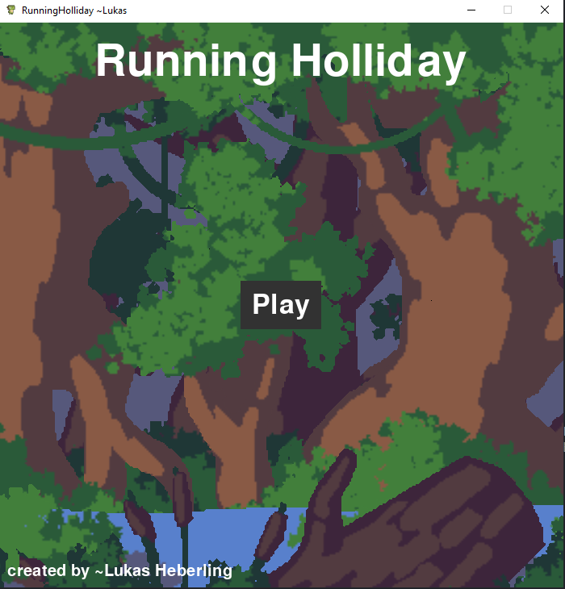
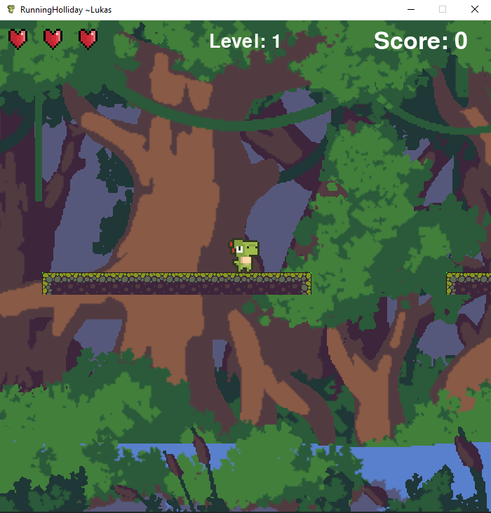

# 🦖 DinoJungleGame 🌴

A small plattformer written in python using pygame

I'm on holiday right now and I just felt like writing a little game again...
I won't have much time, as I'll probably spend most of my time learning to surf. But still, this can be a really fun project! I am excited to see what will come out of it

# 🚀 Installation

If you're eager to give it a try, you're in luck! 😄

First, clone the repository using this command:

```bash
git clone https://github.com/N3moAhead/RunningHolidayGame.git
```

Next, you'll need to install pygame. Use pip to do this:

```bash
pip install pygame
```

Now you're all set to dive into the game yourself:

```bash
python3 RunningHoliday.py
```

# 🎮 The Current Menu

Check out our sleek game menu:



# 🌟 The Game Itself

Get ready for an exciting adventure:



Enjoy 🦕🌿
